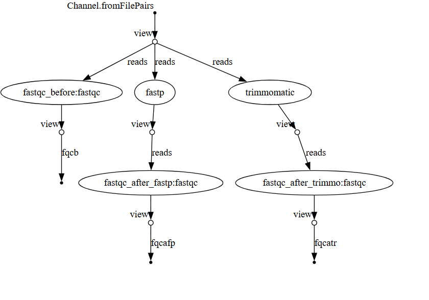

### Workflow exercise
Author: Sharon Kartika

GTID: 904017704

A nextflow pipeline for the workflow exercise in **BIOL7210** at Georgia Tech. 

The pipeline takes in fastq files, runs read cleaning with two different methods (fastp and trimmomatic), and produces quality controls results (using fastqc), both before and after read cleaning.

Test data is contained in `./data`

Fastqc results are copied to `results/fastqc`. 

To **run** the pipeline, use 
```bash
nextflow run main.nf -profile conda --inputdata "./data/SRR*_{1,2}.fastq.gz"
```

### Requirements
Nextflow **version** (`nextflow -version`)
```
version 24.10.5 build 5935
```

Package manager used is conda

OS:
```
ProductName:            macOS
ProductVersion:         14.7.5
BuildVersion:           23H527
```

Architecture (result of `uname -m`):
```
arm64
```

Workflow flowchart shown below. Generated using 

```bash
nextflow run main.nf -profile conda -with-dag flowchart.png --inputdata "./data/SRR*_{1,2}.fastq.gz"
```


